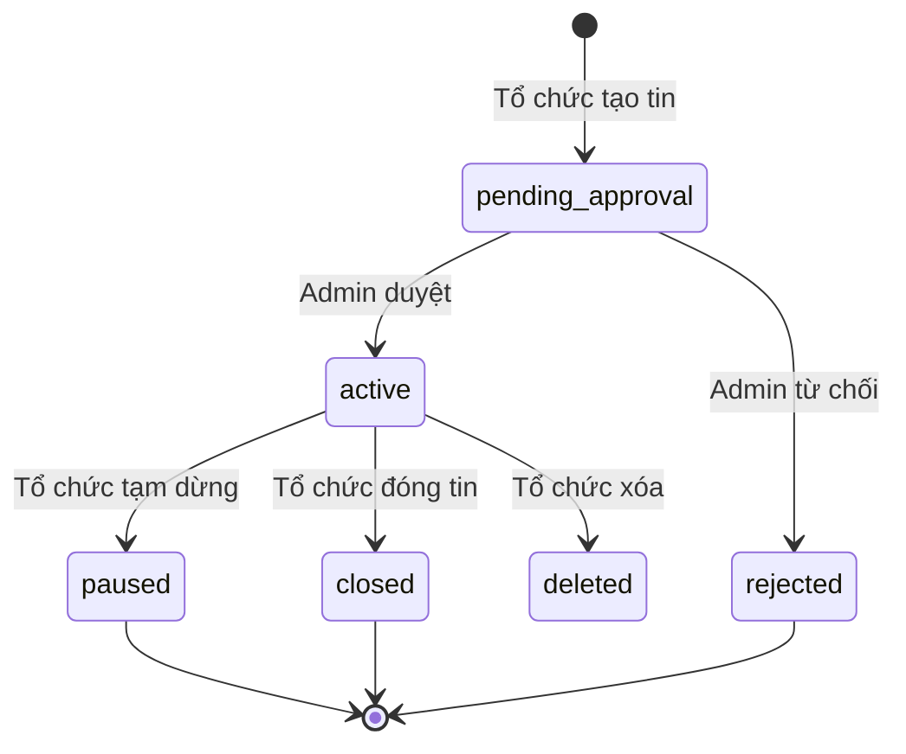

# Tài liệu nghiệp vụ — AI Recruit Backend

> **Trạng thái:** Một phần đã điền (luồng nghiệp vụ **một tin tuyển dụng** và **đơn ứng tuyển**); các mục khác vẫn là khung.

---

## 1. Thông tin tài liệu

| Mục                                     | Nội dung                                    |
| --------------------------------------- | ------------------------------------------- |
| Mục đích tài liệu                       | *Mô tả luồng nghiệp vụ của hệ thống* |
| Phạm vi áp dụng (sản phẩm / môi trường) | *[Chưa điền]*                               |
| Đối tượng đọc                           | *Mọi người*                               |
| Phiên bản                               | *1.0.0*                                     |
| Ngày cập nhật                           | *4/6/2026*                                  |
| Người phê duyệt                         | *Ngô Nguyễn Duy Nhân*                      |
| Tài liệu liên quan                      | `architecture.md`                           |

---

## 2. Tổng quan bối cảnh

### 2.1. Vấn đề kinh doanh cần giải quyết

*[Chưa điền]*

### 2.2. Giá trị mang lại cho từng nhóm stakeholder

*[Chưa điền]*

### 2.3. Giả định & ràng buộc (business)

*[Chưa điền]*

---

## 3. Actor, vai trò và quyền (tổng quan)

### 3.1. Danh sách actor

*[Chưa điền — ví dụ: ứng viên, nhà tuyển dụng, quản trị, hệ thống, …]*

### 3.2. Ma trận vai trò ↔ khả năng (high level)

*[Chưa điền]*

### 3.3. Phân quyền kỹ thuật (Casbin / policy)

*[Chưa điền — mô tả nghiệp vụ, không chỉ tên kỹ thuật]*

---

## 4. Thuật ngữ và chữ viết tắt

| Thuật ngữ / viết tắt             | Định nghĩa                                                                                                                                        |
| -------------------------------- | ------------------------------------------------------------------------------------------------------------------------------------------------- |
| Trạng thái tin (job)             | Tập giá trị nghiệp vụ của tin tuyển dụng; trong hệ thống lưu dưới dạng enum (ví dụ `pending_approval`, `active`, `paused`, `closed`, `rejected`). |
| Trạng thái đơn ứng tuyển (apply) | Trạng thái xử lý hồ sơ ứng tuyển của ứng viên cho một tin; trong hệ thống: `pending`, `accepted`, `rejected`.                                     |
| *[Chưa điền]*                    | *[Chưa điền]*                                                                                                                                     |

---

## 5. Các miền nghiệp vụ (domain)

Mỗi miền: **mục tiêu**, **đối tượng dữ liệu chính**, **quy tắc cốt lõi**, **ngoại lệ / edge cases**.

### 5.1. Xác thực & phiên làm việc (Auth)

- Mục tiêu nghiệp vụ: *[Chưa điền]*
- Luồng đăng ký / đăng nhập / đăng xuất / làm mới token: *[Chưa điền]*
- Ràng buộc bảo mật (theo nghiệp vụ): *[Chưa điền]*

### 5.2. Người dùng & hồ sơ (User)

- Mục tiêu nghiệp vụ: *[Chưa điền]*
- Onboarding / cập nhật hồ sơ: *[Chưa điền]*
- Trạng thái tài khoản (nếu có): *[Chưa điền]*

### 5.3. Tổ chức (Organization)

- Mục tiêu nghiệp vụ: *[Chưa điền]*
- Tạo / chỉnh sửa / vô hiệu hóa tổ chức: *[Chưa điền]*
- Thống kê / giới hạn theo tổ chức (nếu có): *[Chưa điền]*

### 5.4. Thành viên tổ chức (Organization member)

- Mục tiêu nghiệp vụ: *[Chưa điền]*
- Gán vai trò trong tổ chức: *[Chưa điền]*
- Rời / xóa thành viên: *[Chưa điền]*

### 5.5. Lời mời tham gia tổ chức (Organization invitation)

- Mục tiêu nghiệp vụ: *[Chưa điền]*
- Gửi / chấp nhận / từ chối / hết hạn: *[Chưa điền]*

### 5.6. Gói đăng ký & tính năng (Subscription & feature)

- Mục tiêu nghiệp vụ: *[Chưa điền]*
- Gói, tính năng theo gói, nâng cấp / gia hạn / hết hạn: *[Chưa điền]*
- Ảnh hưởng tới các miền khác (job, AI, exam, …): *[Chưa điền]*

### 5.7. Việc làm (Job)

- **Mục tiêu nghiệp vụ:** Cho phép tổ chức đăng tin tuyển dụng, được kiểm duyệt trước khi công khai; sau khi công khai, tổ chức vận hành tin (tạm dừng / đóng / xóa) và xử lý đơn ứng tuyển của ứng viên.
- **Trạng thái tin (`job.status`):**
  - `pending_approval`: Tin vừa được tổ chức tạo, chờ quản trị duyệt (mặc định khi tạo).
  - `active`: Đã duyệt, tin mở cho ứng tuyển theo nghiệp vụ đã thống nhất.
  - `paused`: Tạm dừng (sau khi đã `active`).
  - `closed`: Đóng tin (sau khi đã `active`).
  - `rejected`: Quản trị từ chối duyệt tin (có thể kèm lý do).
- **Quyền theo giai đoạn:**
  - **Trước khi duyệt (`pending_approval`):** Tổ chức được chỉnh sửa nội dung tin cho đến khi quản trị phê duyệt hoặc từ chối. Tổ chức không tự chuyển tin sang `active` — quản trị thực hiện qua luồng duyệt.
  - **Sau khi `active`:** Theo mô tả nghiệp vụ, tổ chức chỉ được các thao tác vận hành trạng thái tin: `**paused`**, `**closed**`, hoặc **xóa** tin. Nếu sản phẩm vẫn cho phép chỉnh sửa nội dung khi đã `active`, cần bổ sung quy tắc riêng ở phiên bản sau.
- **Ứng tuyển:** Chỉ khi tin `**active`** thì ứng viên mới được phép gửi đơn ứng tuyển; đơn mới ở trạng thái `pending` và do tổ chức duyệt — xem mục 6.
- **Tương tác khác:** Lưu tin (`save`) và các hành vi khác theo quy tắc hiển thị / phân quyền (bổ sung sau nếu cần).

### 5.8. Đồng bộ việc làm (Job sync)

- Mục tiêu nghiệp vụ: *[Chưa điền]*
- Nguồn dữ liệu, tần suất, xử lý trùng / lỗi: *[Chưa điền]*

### 5.9. Ghép nối việc làm — matching (Job matching)

- Mục tiêu nghiệp vụ: *[Chưa điền]*
- Tiêu chí matching, điểm số, giải thích kết quả (nếu có): *[Chưa điền]*

### 5.10. CV

- Mục tiêu nghiệp vụ: *[Chưa điền]*
- Tạo / cập nhật / phiên bản / trạng thái: *[Chưa điền]*

### 5.11. AI CV

- Mục tiêu nghiệp vụ: *[Chưa điền]*
- Phân tích / gợi ý / giới hạn sử dụng: *[Chưa điền]*

### 5.12. Bài thi & đánh giá (Exam)

- Mục tiêu nghiệp vụ: *[Chưa điền]*
- Đề / mức độ / chấm điểm / import câu hỏi: *[Chưa điền]*

### 5.13. Lộ trình học (Learning path)

- Mục tiêu nghiệp vụ: *[Chưa điền]*
- Nội dung, tiến độ, liên kết với kỹ năng / việc làm: *[Chưa điền]*

### 5.14. Kỹ năng (Skill)

- Mục tiêu nghiệp vụ: *[Chưa điền]*
- Danh mục, phân cấp, gắn với hồ sơ / tin tuyển dụng: *[Chưa điền]*

### 5.15. Danh mục (Category)

- Mục tiêu nghiệp vụ: *[Chưa điền]*

### 5.16. Dữ liệu tham chiếu — Tỉnh thành (Province)

- Mục tiêu nghiệp vụ: *[Chưa điền]*

### 5.17. Dữ liệu tham chiếu — Trường đại học (University)

- Mục tiêu nghiệp vụ: *[Chưa điền]*

### 5.18. Lưu trữ & tải tệp (Storage / upload)

- Mục tiêu nghiệp vụ: *[Chưa điền]*
- Loại tệp, dung lượng, quyền truy cập: *[Chưa điền]*

### 5.19. Thông báo (Notification)

- Mục tiêu nghiệp vụ: *[Chưa điền]*
- Kênh (in-app, email, …), sự kiện kích hoạt: *[Chưa điền]*

### 5.20. Phản hồi (Feedback)

- Mục tiêu nghiệp vụ: *[Chưa điền]*
- Thu thập, phân loại, xử lý sau thu thập: *[Chưa điền]*

---

## 6. Luồng nghiệp vụ end-to-end (E2E)

*(Mỗi luồng: trigger → bước → kết quả → ghi chú / lỗi thường gặp.)*

### 6.1. Luồng một tin tuyển dụng: tạo → chờ duyệt → active → vận hành

**Actor:** Tổ chức (Organization), Quản trị hệ thống (Admin), Ứng viên (User — bước ứng tuyển).

| Bước | Ai thực hiện        | Hành động                                                                            | Trạng thái tin sau bước                                                                      |
| ---- | ------------------- | ------------------------------------------------------------------------------------ | -------------------------------------------------------------------------------------------- |
| 1    | Tổ chức             | Tạo tin tuyển dụng                                                                   | `pending_approval`                                                                           |
| 2    | Tổ chức             | Chỉnh sửa nội dung tin (tiêu đề, mô tả, yêu cầu, câu hỏi, …) **trong lúc chờ duyệt** | `pending_approval`                                                                           |
| 3    | Quản trị            | **Duyệt** tin → chuyển sang đăng tuyển chính thức                                    | `active`                                                                                     |
| 3′   | Quản trị (tùy chọn) | **Từ chối** tin                                                                      | `rejected` (có thể ghi nhận lý do) — luồng tổ chức chỉnh sửa và gửi lại có thể quy định thêm |
| 4    | Tổ chức             | Khi tin đã `active`: chỉ được **paused**, **closed**, hoặc **xóa** tin               | `paused` / `closed` / (tin bị xóa khỏi vận hành)                                             |
| 5    | Ứng viên            | **Chỉ khi tin `active`:** gửi đơn ứng tuyển (kèm CV, trả lời câu hỏi nếu có)         | Tin vẫn `active`; tạo bản ghi đơn ứng tuyển — xem mục 6.2                                    |

**Sơ đồ trạng thái (tóm tắt):**

*(Nếu sau này có nghiệp vụ “mở lại” tin từ `paused` về `active`, bổ sung chuyển trạng thái tương ứng trên sơ đồ.)*

**Ghi chú kỹ thuật (tham chiếu):** Trạng thái tin khớp enum `job_status` trong codebase (`pending_approval`, `active`, `paused`, `closed`, `rejected`). Luồng cập nhật tin của tổ chức sau `pending_approval` được kiểm soát để tổ chức không tự đặt trạng thái `active`/`paused`/`closed` khi tin chưa ở nhóm trạng thái vận hành tương ứng — quản trị dùng luồng cập nhật dành cho admin để phê duyệt.

---

### 6.2. Luồng đơn ứng tuyển: nộp hồ sơ → tổ chức duyệt

**Điều kiện mở đầu:** Tin tuyển dụng ở trạng thái `**active*`* (theo nghiệp vụ đã thống nhất).

| Bước | Ai thực hiện | Hành động                                        | Trạng thái đơn (`apply`)   |
| ---- | ------------ | ------------------------------------------------ | -------------------------- |
| 1    | Ứng viên     | Nộp đơn với CV (và câu trả lời tùy cấu hình tin) | `pending`                  |
| 2    | Tổ chức      | Xem danh sách đơn, đánh giá hồ sơ                | `pending`                  |
| 3    | Tổ chức      | **Chấp nhận** hoặc **từ chối** đơn               | `accepted` hoặc `rejected` |

**Kết quả:** Ứng viên nhận thông báo phù hợp (ví dụ đơn được chấp nhận / bị từ chối) theo cấu hình thông báo của hệ thống.

**Ghi chú:** Một ứng viên thường chỉ có một đơn cho một tin (tránh trùng); vi phạm sẽ trả lỗi nghiệp vụ / kỹ thuật tương ứng.

**Triển khai:** Quy tắc “chỉ ứng tuyển khi tin `active`” nên được áp dụng nhất quán (client + API); nếu cần, bổ sung kiểm tra trạng thái tin ngay trong use-case ứng tuyển để khớp hoàn toàn với nghiệp vụ.

---

### 6.3. Các luồng E2E khác

*[Chưa điền — ví dụ: đồng bộ tin, matching, onboarding tổ chức, …]*

---

## 7. Quy tắc nghiệp vụ tổng hợp (cross-domain)

### 7.1. Ưu tiên khi xung đột quy tắc

*[Chưa điền]*

### 7.2. Nhất quán dữ liệu giữa các miền

*[Chưa điền]*

### 7.3. Tuân thủ & audit (nếu áp dụng)

*[Chưa điền]*

---

## 8. Tích hợp bên ngoài

| Hệ thống / dịch vụ | Mục đích nghiệp vụ | Ghi chú       |
| ------------------ | ------------------ | ------------- |
| *[Chưa điền]*      | *[Chưa điền]*      | *[Chưa điền]* |

---

## 9. Chỉ số & chất lượng dịch vụ (tùy chọn)

*[Chưa điền — SLA, KPI nghiệp vụ nếu có]*

---

## 10. Phụ lục

### 10.1. Sơ đồ domain (conceptual) — placeholder

*[Chưa điền — có thể bổ sung diagram sau]*

### 10.2. Mapping miền nghiệp vụ ↔ module kỹ thuật (tham chiếu)

| Miền (mục 5)                             | Gợi ý module trong codebase                                                |
| ---------------------------------------- | -------------------------------------------------------------------------- |
| Auth                                     | `use-cases/auth`, Casbin                                                   |
| User                                     | `use-cases/user`                                                           |
| Organization / member / invitation       | `use-cases/organization`, `organization-member`, `organization-invitation` |
| Subscription / feature                   | `use-cases/subscription`, `feature`                                        |
| Job / sync / matching                    | `use-cases/job`, `job-sync`, `job-matching`                                |
| CV / AI CV                               | `use-cases/cv`, `ai-cv`                                                    |
| Exam / learning path                     | `use-cases/exam`, `learning-path`                                          |
| Skill / category / province / university | `skill`, `category`, `province`, `university`                              |
| Storage                                  | `use-cases/storage`                                                        |
| Notification                             | `use-cases/notification`                                                   |
| Feedback                                 | `use-cases/feedback`                                                       |

---

## 11. Lịch sử thay đổi tài liệu

| Phiên bản | Ngày          | Mô tả ngắn                                                           |
| --------- | ------------- | -------------------------------------------------------------------- |
| 0.1       | *[Chưa điền]* | Tạo khung tài liệu nghiệp vụ (skeleton)                              |
| 1.1       | 2026-04-06    | Điền luồng nghiệp vụ một tin tuyển dụng và luồng duyệt đơn ứng tuyển |

