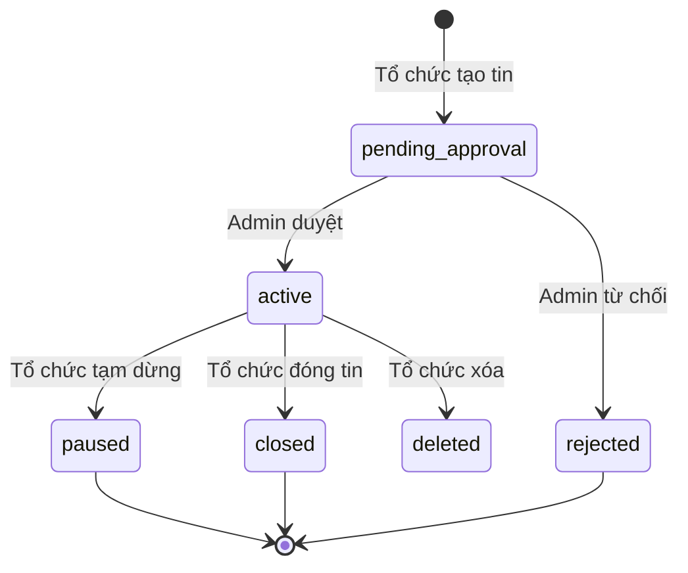
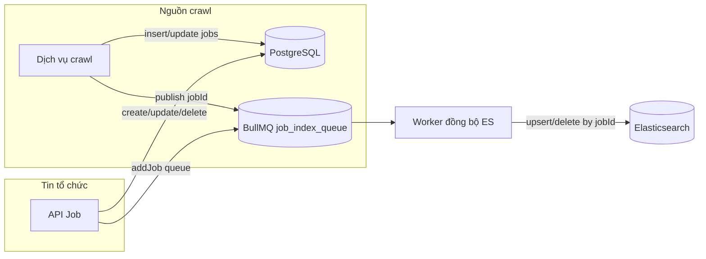
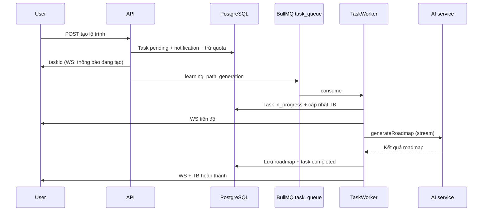

# Tài liệu nghiệp vụ — AI Recruit Backend

> **Trạng thái:** Một phần đã điền: luồng **một tin tuyển dụng**, **đơn ứng tuyển**, **crawl / đồng bộ Elasticsearch**, và **tạo lộ trình học (async qua queue + AI)**; các mục khác vẫn là khung.

---

## 1. Thông tin tài liệu

| Mục                                     | Nội dung                             |
| --------------------------------------- | ------------------------------------ |
| Mục đích tài liệu                       | _Mô tả luồng nghiệp vụ của hệ thống_ |
| Phạm vi áp dụng (sản phẩm / môi trường) | _[Chưa điền]_                        |
| Đối tượng đọc                           | _Mọi người_                          |
| Phiên bản                               | _1.0.0_                              |
| Ngày cập nhật                           | _4/6/2026_                           |
| Người phê duyệt                         | _Ngô Nguyễn Duy Nhân_                |
| Tài liệu liên quan                      | `architecture.md`                    |

---

## 2. Tổng quan bối cảnh

### 2.1. Vấn đề kinh doanh cần giải quyết

_[Chưa điền]_

### 2.2. Giá trị mang lại cho từng nhóm stakeholder

_[Chưa điền]_

### 2.3. Giả định & ràng buộc (business)

_[Chưa điền]_

---

## 3. Actor, vai trò và quyền (tổng quan)

### 3.1. Danh sách actor

_[Chưa điền — ví dụ: ứng viên, nhà tuyển dụng, quản trị, hệ thống, …]_

### 3.2. Ma trận vai trò ↔ khả năng (high level)

_[Chưa điền]_

### 3.3. Phân quyền kỹ thuật (Casbin / policy)

_[Chưa điền — mô tả nghiệp vụ, không chỉ tên kỹ thuật]_

---

## 4. Thuật ngữ và chữ viết tắt

| Thuật ngữ / viết tắt               | Định nghĩa                                                                                                                                        |
| ---------------------------------- | ------------------------------------------------------------------------------------------------------------------------------------------------- |
| Trạng thái tin (job)               | Tập giá trị nghiệp vụ của tin tuyển dụng; trong hệ thống lưu dưới dạng enum (ví dụ `pending_approval`, `active`, `paused`, `closed`, `rejected`). |
| Trạng thái đơn ứng tuyển (apply)   | Trạng thái xử lý hồ sơ ứng tuyển của ứng viên cho một tin; trong hệ thống: `pending`, `accepted`, `rejected`.                                     |
| Chỉ mục tìm kiếm (job index)       | Bản sao dữ liệu tin tuyển dụng phục vụ tìm kiếm/lọc, lưu trên **Elasticsearch** (khác bảng `jobs` trên PostgreSQL).                               |
| Hàng đợi đồng bộ (job index queue) | Hàng đợi **BullMQ** (`job_index_queue`): mỗi phần tử là một “việc” xử lý sự kiện đồng bộ chỉ mục (`upsert.job`, `delete.job`, …).                 |
| Hàng đợi tác vụ (task queue)       | Hàng đợi **BullMQ** (`task_queue`): chứa tác vụ bất đồng bộ như **sinh lộ trình học** (`learning_path_generation`).                                |
| Tác vụ (task)                      | Bản ghi theo dõi một xử lý lâu (pending → in_progress → completed / failed), lưu input (ví dụ yêu cầu lộ trình) và kết quả / lỗi.                      |
| _[Chưa điền]_                      | _[Chưa điền]_                                                                                                                                     |

---

## 5. Các miền nghiệp vụ (domain)

Mỗi miền: **mục tiêu**, **đối tượng dữ liệu chính**, **quy tắc cốt lõi**, **ngoại lệ / edge cases**.

### 5.1. Xác thực & phiên làm việc (Auth)

- Mục tiêu nghiệp vụ: _[Chưa điền]_
- Luồng đăng ký / đăng nhập / đăng xuất / làm mới token: _[Chưa điền]_
- Ràng buộc bảo mật (theo nghiệp vụ): _[Chưa điền]_

### 5.2. Người dùng & hồ sơ (User)

- Mục tiêu nghiệp vụ: _[Chưa điền]_
- Onboarding / cập nhật hồ sơ: _[Chưa điền]_
- Trạng thái tài khoản (nếu có): _[Chưa điền]_

### 5.3. Tổ chức (Organization)

- Mục tiêu nghiệp vụ: _[Chưa điền]_
- Tạo / chỉnh sửa / vô hiệu hóa tổ chức: _[Chưa điền]_
- Thống kê / giới hạn theo tổ chức (nếu có): _[Chưa điền]_

### 5.4. Thành viên tổ chức (Organization member)

- Mục tiêu nghiệp vụ: _[Chưa điền]_
- Gán vai trò trong tổ chức: _[Chưa điền]_
- Rời / xóa thành viên: _[Chưa điền]_

### 5.5. Lời mời tham gia tổ chức (Organization invitation)

- Mục tiêu nghiệp vụ: _[Chưa điền]_
- Gửi / chấp nhận / từ chối / hết hạn: _[Chưa điền]_

### 5.6. Gói đăng ký & tính năng (Subscription & feature)

- Mục tiêu nghiệp vụ: _[Chưa điền]_
- Gói, tính năng theo gói, nâng cấp / gia hạn / hết hạn: _[Chưa điền]_
- Ảnh hưởng tới các miền khác (job, AI, exam, …): _[Chưa điền]_

### 5.7. Việc làm (Job)

- **Mục tiêu nghiệp vụ:** Cho phép tổ chức đăng tin tuyển dụng, được kiểm duyệt trước khi công khai; sau khi công khai, tổ chức vận hành tin (tạm dừng / đóng / xóa) và xử lý đơn ứng tuyển của ứng viên.
- **Trạng thái tin (`job.status`):**
  - `pending_approval`: Tin vừa được tổ chức tạo, chờ quản trị duyệt (mặc định khi tạo).
  - `active`: Đã duyệt, tin mở cho ứng tuyển theo nghiệp vụ đã thống nhất.
  - `paused`: Tạm dừng (sau khi đã `active`).
  - `closed`: Đóng tin (sau khi đã `active`).
  - `rejected`: Quản trị từ chối duyệt tin (có thể kèm lý do).
- **Quyền theo giai đoạn:**
  - **Trước khi duyệt (`pending_approval`):** Tổ chức được chỉnh sửa nội dung tin cho đến khi quản trị phê duyệt hoặc từ chối. Tổ chức không tự chuyển tin sang `active` — quản trị thực hiện qua luồng duyệt.
  - **Sau khi `active`:** Theo mô tả nghiệp vụ, tổ chức chỉ được các thao tác vận hành trạng thái tin: **paused**, **closed**, hoặc **xóa** tin. Nếu sản phẩm vẫn cho phép chỉnh sửa nội dung khi đã `active`, cần bổ sung quy tắc riêng ở phiên bản sau.
- **Ứng tuyển:** Chỉ khi tin **active** thì ứng viên mới được phép gửi đơn ứng tuyển; đơn mới ở trạng thái `pending` và do tổ chức duyệt — xem mục 6.
- **Tương tác khác:** Lưu tin (`save`) và các hành vi khác theo quy tắc hiển thị / phân quyền (bổ sung sau nếu cần).

### 5.8. Đồng bộ việc làm & chỉ mục tìm kiếm (Job sync / Elasticsearch)

- **Mục tiêu nghiệp vụ:** Dữ liệu tin tuyển dụng trên PostgreSQL là nguồn sự thật; **Elasticsearch** giữ chỉ mục phục vụ tìm kiếm, gợi ý và matching. Mọi thay đổi đáng kể trên tin (tạo/sửa/xóa theo luồng hệ thống) cần được phản ánh vào chỉ mục **bất đồng bộ** qua hàng đợi để tránh chặn request và tách tải.
- **Hai nguồn ghi DB chính:**
  1. **Dịch vụ crawl:** Thu thập tin từ các nguồn bên ngoài, **insert/cập nhật** vào database; sau mỗi lượt (hoặc theo lô), **đăng `jobId`** lên message queue để backend đồng bộ ES.
  2. **Tổ chức (org):** Tạo/sửa/xóa tin qua API — sau khi giao dịch DB thành công, backend **đăng cùng loại sự kiện** lên queue để worker cập nhật/xóa document tương ứng trên ES.
- **Hàng đợi:** Dùng **BullMQ** (triển khai hiện tại) — hàng đợi chỉ mục job (`job_index_queue`). Worker backend tiêu thụ và gọi Elasticsearch (index / delete theo loại sự kiện).
- **Tần suất crawl, chống trùng nguồn, retry khi ES lỗi:** _[Chi tiết vận hành theo dịch vụ crawl và cấu hình queue — bổ sung sau]_

### 5.9. Ghép nối việc làm — matching (Job matching)

- Mục tiêu nghiệp vụ: _[Chưa điền]_
- Tiêu chí matching, điểm số, giải thích kết quả (nếu có): _[Chưa điền]_

### 5.10. CV

- Mục tiêu nghiệp vụ: _[Chưa điền]_
- Tạo / cập nhật / phiên bản / trạng thái: _[Chưa điền]_

### 5.11. AI CV

- Mục tiêu nghiệp vụ: _[Chưa điền]_
- Phân tích / gợi ý / giới hạn sử dụng: _[Chưa điền]_

### 5.12. Bài thi & đánh giá (Exam)

- Mục tiêu nghiệp vụ: _[Chưa điền]_
- Đề / mức độ / chấm điểm / import câu hỏi: _[Chưa điền]_

### 5.13. Lộ trình học (Learning path)

- **Mục tiêu nghiệp vụ:** Gợi ý lộ trình học tập cá nhân hóa (vai hiện tại, vai mục tiêu, mức cam kết thời gian, kỹ năng hiện có) nhờ **dịch vụ AI**; kết quả được lưu thành roadmap (phase, skill, tài nguyên…) để người dùng theo dõi tiến độ.
- **Tạo lộ trình:** Không chạy AI trong request HTTP. Hệ thống **trừ quota** tính năng (`learning_path`), tạo **task** trạng thái `pending`, tạo **thông báo** “đang tạo”, gửi realtime cho user, rồi **đẩy** `{ taskId, notificationId }` lên **queue** (`task_queue`). Worker gọi AI, lưu roadmap vào DB, cập nhật task thành `completed`/`failed` và **cập nhật thông báo + WebSocket** để user biết khi xong.
- **Theo dõi:** Người dùng tra cứu danh sách roadmap / tiến độ tuần theo API tương ứng (_[chi tiết màn hình — bổ sung sau]_).

### 5.14. Kỹ năng (Skill)

- Mục tiêu nghiệp vụ: _[Chưa điền]_
- Danh mục, phân cấp, gắn với hồ sơ / tin tuyển dụng: _[Chưa điền]_

### 5.15. Danh mục (Category)

- Mục tiêu nghiệp vụ: _[Chưa điền]_

### 5.16. Dữ liệu tham chiếu — Tỉnh thành (Province)

- Mục tiêu nghiệp vụ: _[Chưa điền]_

### 5.17. Dữ liệu tham chiếu — Trường đại học (University)

- Mục tiêu nghiệp vụ: _[Chưa điền]_

### 5.18. Lưu trữ & tải tệp (Storage / upload)

- Mục tiêu nghiệp vụ: _[Chưa điền]_
- Loại tệp, dung lượng, quyền truy cập: _[Chưa điền]_

### 5.19. Thông báo (Notification)

- Mục tiêu nghiệp vụ: _[Chưa điền]_
- Kênh (in-app, email, …), sự kiện kích hoạt: _[Chưa điền]_

### 5.20. Phản hồi (Feedback)

- Mục tiêu nghiệp vụ: _[Chưa điền]_
- Thu thập, phân loại, xử lý sau thu thập: _[Chưa điền]_

---

## 6. Luồng nghiệp vụ end-to-end (E2E)

_(Mỗi luồng: trigger → bước → kết quả → ghi chú / lỗi thường gặp.)_

### 6.1. Luồng một tin tuyển dụng: tạo → chờ duyệt → active → vận hành

**Actor:** Tổ chức (Organization), Quản trị hệ thống (Admin), Ứng viên (User — bước ứng tuyển).

| Bước | Ai thực hiện        | Hành động                                                                            | Trạng thái tin sau bước                                                                      |
| ---- | ------------------- | ------------------------------------------------------------------------------------ | -------------------------------------------------------------------------------------------- |
| 1    | Tổ chức             | Tạo tin tuyển dụng                                                                   | `pending_approval`                                                                           |
| 2    | Tổ chức             | Chỉnh sửa nội dung tin (tiêu đề, mô tả, yêu cầu, câu hỏi, …) **trong lúc chờ duyệt** | `pending_approval`                                                                           |
| 3    | Quản trị            | **Duyệt** tin → chuyển sang đăng tuyển chính thức                                    | `active`                                                                                     |
| 3′   | Quản trị (tùy chọn) | **Từ chối** tin                                                                      | `rejected` (có thể ghi nhận lý do) — luồng tổ chức chỉnh sửa và gửi lại có thể quy định thêm |
| 4    | Tổ chức             | Khi tin đã `active`: chỉ được **paused**, **closed**, hoặc **xóa** tin               | `paused` / `closed` / (tin bị xóa khỏi vận hành)                                             |
| 5    | Ứng viên            | **Chỉ khi tin `active`:** gửi đơn ứng tuyển (kèm CV, trả lời câu hỏi nếu có)         | Tin vẫn `active`; tạo bản ghi đơn ứng tuyển — xem mục 6.2                                    |

**Sơ đồ trạng thái (tóm tắt):**

_(Nếu sau này có nghiệp vụ “mở lại” tin từ `paused` về `active`, bổ sung chuyển trạng thái tương ứng trên sơ đồ.)_

**Ghi chú kỹ thuật (tham chiếu):** Trạng thái tin khớp enum `job_status` trong codebase (`pending_approval`, `active`, `paused`, `closed`, `rejected`). Luồng cập nhật tin của tổ chức sau `pending_approval` được kiểm soát để tổ chức không tự đặt trạng thái `active`/`paused`/`closed` khi tin chưa ở nhóm trạng thái vận hành tương ứng — quản trị dùng luồng cập nhật dành cho admin để phê duyệt.

---

### 6.2. Luồng đơn ứng tuyển: nộp hồ sơ → tổ chức duyệt

**Điều kiện mở đầu:** Tin tuyển dụng ở trạng thái **`active`** (theo nghiệp vụ đã thống nhất).

| Bước | Ai thực hiện | Hành động                                        | Trạng thái đơn (`apply`)   |
| ---- | ------------ | ------------------------------------------------ | -------------------------- |
| 1    | Ứng viên     | Nộp đơn với CV (và câu trả lời tùy cấu hình tin) | `pending`                  |
| 2    | Tổ chức      | Xem danh sách đơn, đánh giá hồ sơ                | `pending`                  |
| 3    | Tổ chức      | **Chấp nhận** hoặc **từ chối** đơn               | `accepted` hoặc `rejected` |

**Kết quả:** Ứng viên nhận thông báo phù hợp (ví dụ đơn được chấp nhận / bị từ chối) theo cấu hình thông báo của hệ thống.

**Ghi chú:** Một ứng viên thường chỉ có một đơn cho một tin (tránh trùng); vi phạm sẽ trả lỗi nghiệp vụ / kỹ thuật tương ứng.

**Triển khai:** Quy tắc “chỉ ứng tuyển khi tin `active`” nên được áp dụng nhất quán (client + API); nếu cần, bổ sung kiểm tra trạng thái tin ngay trong use-case ứng tuyển để khớp hoàn toàn với nghiệp vụ.

---

### 6.3. Luồng crawl, hàng đợi và đồng bộ Elasticsearch (job → ES)

**Mục tiêu:** Giữ chỉ mục Elasticsearch khớp với dữ liệu tin trên PostgreSQL khi tin đến từ **crawl** hoặc từ **tổ chức**, mà không phải ghi ES đồng bộ trong cùng request HTTP.

**Thành phần:**

| Thành phần                    | Vai trò                                                                                                                                                 |
| ----------------------------- | ------------------------------------------------------------------------------------------------------------------------------------------------------- |
| Dịch vụ crawl (service riêng) | Crawl từ các nguồn cấu hình → ghi vào DB → **publish danh sách `jobId`** vào message queue (BullMQ).                                                    |
| API backend (org jobs)        | Sau **tạo / cập nhật** tin (và các trường hợp đẩy `UPSERT_JOB` trong code), hoặc sau **xóa** tin (`DELETE_JOB`), đăng việc tương ứng lên cùng hàng đợi. |
| Worker (`JobIndexWorker`)     | Lắng nghe queue `job_index_queue`, xử lý từng message: đọc đủ dữ liệu tin từ DB (khi upsert), **index / cập nhật / xóa** document trên Elasticsearch.   |

**Luồng tổng quát:**

**Chi tiết nghiệp vụ:**

1. **Sau crawl:** Dữ liệu đã nằm trong DB; việc publish `jobIds[]` chỉ kích hoạt **đồng bộ chỉ mục**, không thay thế bước ghi DB. Có thể đẩy **từng `jobId` một message** hoặc gom lô — miễn worker cuối cùng xử lý được (trong code hiện tại, mỗi lần `addJob` tương ứng một `jobId` cho sự kiện `upsert.job` / `delete.job`).
2. **Sau tạo/sửa/xóa tin org:** Cùng cơ chế: DB commit trước, rồi enqueue — worker đọc lại snapshot đầy đủ từ DB rồi ghi lên ES (upsert), hoặc xóa document khi tin bị xóa.
3. **Elasticsearch** là lớp đọc cho tìm kiếm; nếu worker lỗi cần có chiến lược **retry** (BullMQ) và/hoặc đồng bộ lại theo batch (màn hình admin / job `job-sync` nếu có).

**Sự kiện liên quan tổ chức trên cùng index (tham chiếu kỹ thuật):** Khi đổi tên/xóa tổ chức, hệ thống có thể đăng `update.org` / `delete.org` để cập nhật hoặc gỡ document theo `organizationId` trên ES — không thuộc luồng crawl nhưng dùng chung worker chỉ mục.

---

### 6.4. Luồng tạo lộ trình học (async: task → queue → worker → AI)

**Actor:** Người dùng đã đăng nhập; **Dịch vụ AI** (qua `IAIService`); **Worker** (`TaskWorker`).

**Điều kiện:** User có quyền dùng tính năng **learning path** (quota được trừ khi bắt đầu).

| Bước | Thành phần | Hành động |
| ---- | ---------- | --------- |
| 1 | API (use-case) | Nhận `POST /learning-roadmaps` với tham số lộ trình (vai hiện tại, vai đích, giờ/tuần, kỹ năng hiện có, …). |
| 2 | Transaction DB | Trừ **feature usage** (`learning_path`), tạo bản ghi **task** (`learning_path_generation`, `pending`), lưu input vào `task.input`, tạo **thông báo** hệ thống “đang tạo lộ trình”. |
| 3 | Realtime | Gửi thông báo vừa tạo tới user qua **WebSocket** (một lần). |
| 4 | Message queue | `addTask` tên `learning_path_generation` với payload `{ taskId, notificationId }` lên **BullMQ** `task_queue` (có retry khi enqueue). |
| 5 | Response HTTP | Trả `taskId` ngay — user không chờ AI trong request. |
| 6 | Worker | Lấy task, đặt trạng thái **in_progress**, cập nhật thông báo + push WebSocket (“Đang tạo lộ trình học tập của bạn…”). |
| 7 | Worker + AI | Gọi **`generateRoadmap`** (stream); nhận kết quả cấu trúc roadmap từ AI. |
| 8 | Worker + DB | **Ghi roadmap** (roadmap, phase, skill, option, prerequisite, …) trong transaction. |
| 9 | Worker | Cập nhật task **completed** kèm `roadmapId` (và payload kết quả), cập nhật thông báo “Lộ trình học tập của bạn đã sẵn sàng”, **WebSocket** lại cho user. |
| 10 (lỗi) | Worker | Task **failed**, thông báo lỗi, WebSocket cập nhật tương ứng. |

**Sơ đồ:**

**Ghi chú triển khai:** Code có TODO **outbox pattern** để enqueue sau DB bền vững hơn; hiện dùng retry khi `addTask`. Worker xử lý `TaskTypeEnum.LEARNING_PATH_GENERATION` trên `TASK_QUEUE` (concurrency 4).

---

### 6.5. Các luồng E2E khác

_[Chưa điền — ví dụ: matching, onboarding tổ chức, …]_

---

## 7. Quy tắc nghiệp vụ tổng hợp (cross-domain)

### 7.1. Ưu tiên khi xung đột quy tắc

_[Chưa điền]_

### 7.2. Nhất quán dữ liệu giữa các miền

- **PostgreSQL ↔ Elasticsearch (tin tuyển dụng):** Nguồn sự thật là DB; ES eventual consistency qua queue. Nếu cần đảm bảo người dùng thấy kết quả tìm kiếm cập nhật ngay, xem xét SLA retry worker hoặc đồng bộ bù (_[chi tiết vận hành — bổ sung sau]_).

### 7.3. Tuân thủ & audit (nếu áp dụng)

_[Chưa điền]_

---

## 8. Tích hợp bên ngoài

| Hệ thống / dịch vụ | Mục đích nghiệp vụ | Ghi chú |
| ------------------ | ------------------ | ------- |
| Dịch vụ AI (lộ trình học) | Sinh nội dung roadmap từ input người dùng (stream) | Gọi từ `TaskWorker` qua `IAIService.generateRoadmap` |
| _[Chưa điền]_ | _[Chưa điền]_ | _[Chưa điền]_ |

---

## 9. Chỉ số & chất lượng dịch vụ (tùy chọn)

_[Chưa điền — SLA, KPI nghiệp vụ nếu có]_

---

## 10. Phụ lục

### 10.1. Sơ đồ domain (conceptual) — placeholder

_[Chưa điền — có thể bổ sung diagram sau]_

### 10.2. Mapping miền nghiệp vụ ↔ module kỹ thuật (tham chiếu)

| Miền (mục 5)                             | Gợi ý module trong codebase                                                |
| ---------------------------------------- | -------------------------------------------------------------------------- |
| Auth                                     | `use-cases/auth`, Casbin                                                   |
| User                                     | `use-cases/user`                                                           |
| Organization / member / invitation       | `use-cases/organization`, `organization-member`, `organization-invitation` |
| Subscription / feature                   | `use-cases/subscription`, `feature`                                        |
| Job / sync / matching                    | `use-cases/job`, `job-sync`, `job-matching`                                |
| CV / AI CV                               | `use-cases/cv`, `ai-cv`                                                    |
| Exam                                     | `use-cases/exam`                                                         |
| Learning path                            | `use-cases/learning-path`, `frameworks/schedulers/task.worker` (queue `task_queue`) |
| Skill / category / province / university | `skill`, `category`, `province`, `university`                              |
| Storage                                  | `use-cases/storage`                                                        |
| Notification                             | `use-cases/notification`                                                   |
| Feedback                                 | `use-cases/feedback`                                                       |

---

## 11. Lịch sử thay đổi tài liệu

| Phiên bản | Ngày       | Mô tả ngắn                                                             |
| --------- | ---------- | ---------------------------------------------------------------------- |
| 1.1       | 2026-04-06 | Điền luồng nghiệp vụ một tin tuyển dụng và luồng duyệt đơn ứng tuyển   |
| 1.2       | 2026-04-06 | Điền miền đồng bộ job và luồng crawl → BullMQ → worker → Elasticsearch |
| 1.3       | 2026-04-06 | Điền miền learning path và luồng task → queue → worker → AI → thông báo user |
